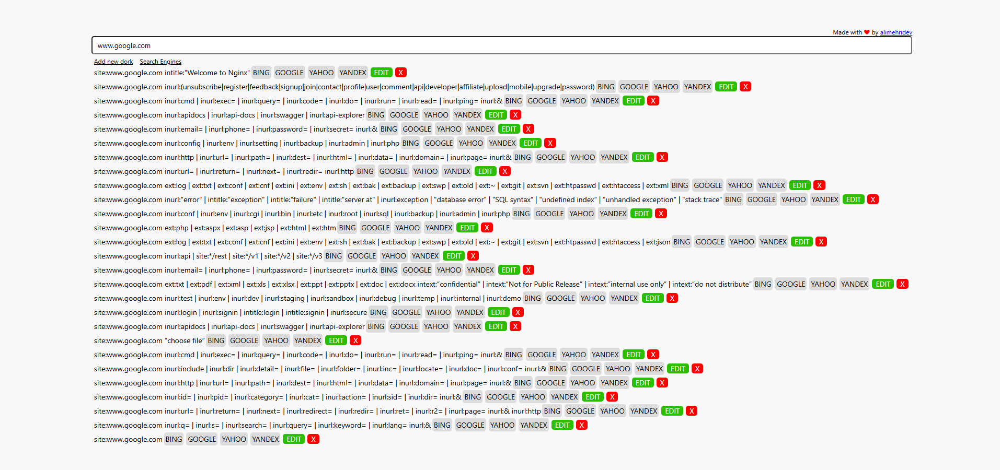

# Dorker

Dorker is a Chrome extension that generates dorks from the current URL using various search engines. You can customize it by adding your own dorks and search engines.

## Features

* Add your own custom dorks
* Add new search engines
* Edit existing dorks and search engines

## Installation

1. Clone or download this repository.
2. Open **Chrome** and go to `chrome://extensions/`.
3. Enable **Developer mode** (toggle on top-right).
4. Click **Load unpacked** and select the project folder.

## Usage

1. Install the extension as described above.
2. Navigate to the website you want to make dorks from.
3. Click on the Dorker extension icon.
4. The extension will generate dorks for the current page.

## Screenshots

## License

This project is licensed under the MIT License – feel free to use, modify, and distribute it.
